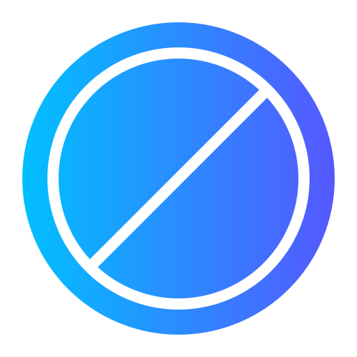

# 🛡️ FocusShield — Website Blocker & Danger Zone (v2.2)

> **Block distracting websites, enter deep focus, and conquer procrastination with un-bypassable Hardcore Locks, PIN Security, and dynamic Danger Zone splash alerts.**



---

## ⚡ Features at a Glance

### 1. 🔐 Master PIN Gatekeeper & Security
* **Startup Lock Screen**: Require a 4-digit PIN every time FocusShield is opened.
* **Tamper-Resistant**: Unblocking websites or disabling category shields requires entering the master PIN.

### 2. ⚡ Irreversible Hardcore Lock Mode
* Choose a duration: **30 Mins, 1 Hour, 2 Hours, 4 Hours, Until Midnight, or Until 8 AM Tomorrow**.
* **Strict Lockout**: Once engaged, unblocking websites and turning off categories is **strictly locked and cannot be bypassed or cancelled** until the timer expires.
* Live countdown displays in the popup, header banner, and Chrome toolbar badge.

### 3. 🏷️ Dynamic & Editable Categories
* Pre-configured with major bundles:
  * 🍿 **Movies**: `net77.cc`, `imdb.com`, `rottentomatoes.com`, `fmovies.to`, etc.
  * 🎵 **Music**: `spotify.com`, `soundcloud.com`, `deezer.com`, `music.apple.com`, etc.
  * 🎮 **Games**: `discord.com`, `roblox.com`, `steampowered.com`, `epicgames.com`, `twitch.tv`
  * 📱 **Social Media**: `instagram.com`, `facebook.com`, `x.com`, `reddit.com`, `tiktok.com`
  * 🎬 **Streaming & Video**: `youtube.com`, `netflix.com`, `primevideo.com`, `disneyplus.com`
* **Custom Categories**: Create brand new categories with custom names and emoji icons (🛍️, 📰, 📚, 🎵, 🛒, 🪙, 💻, ⚡).
* **Inline Website Management**: Expand any category card to view website chips, add new websites, or remove existing ones.

### 4. 🔗 1-Click / Double-Click Website Category Assignment
* Under Custom Blocklist, **double-click** any website or click its `🏷️ Category` button to instantly assign it to any category with **1 click**.

### 5. 🌐 1-Click "Block Current Website"
* Auto-detects the active website in your current tab.
* Click **"🚫 Block [domain]"** to shield it immediately, or see **"✅ Already Shielded"** if it's already blocked.

### 6. ☠️ Custom "Danger Zone" Block Screen (`blocked.html`)
* Replaces Chrome's generic error with a dark cyberpunk **Danger Zone** alert.
* Pulsing radar skull icon (💀), high-impact discipline quotes (David Goggins, James Clear, etc.), live distraction counters, and an interactive **60-second Box Breathing Dopamine Reset guide**.

### 7. 🔥 Daily Focus Streak & Analytics
* Tracks consecutive days of focus without breaking discipline.
* Real-time counters for blocked attempts today & all-time, plus a top distractions breakdown.

---

## 🛠️ Installation & Setup (Chrome / Brave / Edge)

1. Clone or download this repository.
2. Open your Chromium browser and go to `chrome://extensions` (or `brave://extensions` / `edge://extensions`).
3. Enable **Developer mode** in the top-right corner.
4. Click **Load unpacked** and select the folder containing this extension.
5. Pin **FocusShield** to your browser toolbar and start mastering your focus!

---

## 📁 Project Structure

```
Focus-Shield/
├── manifest.json       # Manifest V3 Configuration
├── background.js       # Background service worker & DNR dynamic rule sync
├── popup.html          # Extension popup UI with tabs and modals
├── popup.css           # Glassmorphic dark styling & micro-animations
├── popup.js            # Controller for lock screens, categories, and blocklists
├── blocked.html        # Danger Zone custom block landing page
├── blocked.css         # Cyberpunk hazard styling & breathing ring
├── blocked.js          # Distraction logger, quotes, and breathing logic
├── icons/              # Extension icons (16px, 48px, 128px)
└── README.md           # Documentation
```

---

## 📄 License

MIT License. Feel free to use, modify, and distribute.
